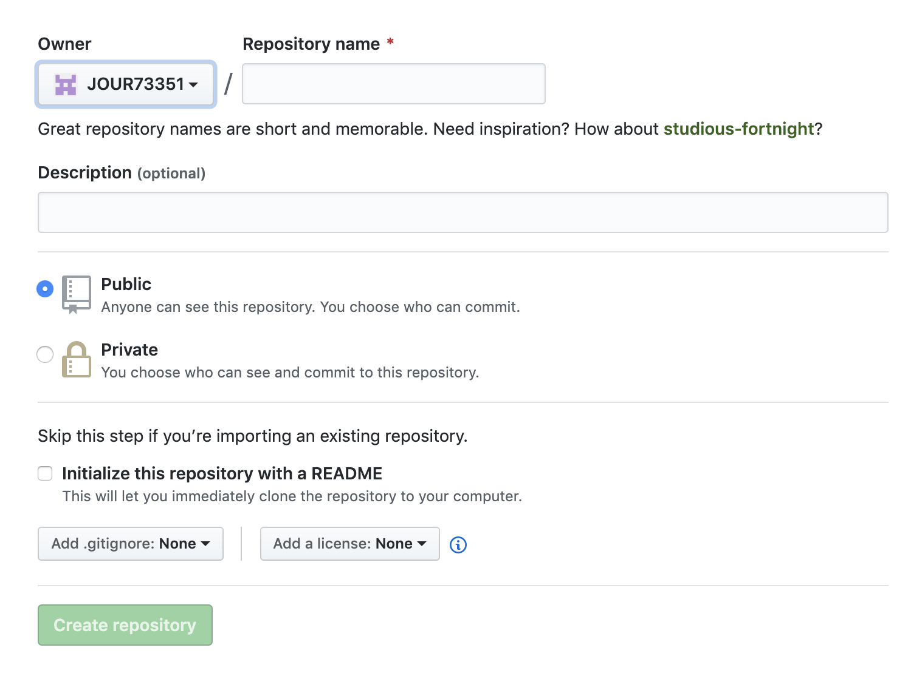

How is the immigration trend in the U.S. now?

    Since the Trump administration took power in 2016, the U.S. immigration policies became more and more strict and limited. What's worse, for undocumented immigrants, deportation threatens them a lot.

Make sure your pitch answers the following questions:

-   What's the story and why do you want to tell it?
    The story about immigrants in the U.S. with deportation proceedings filed in immigration courts. As the Trump administration limited the immigration policies much more than before, it is worthwhile to explore the data of deportation issues for some immigrants.
-   What is the single question your story tries to answer?
    What's the future for immigrants in the U.S. with the much more series immigration policies in recent years?
-   Why will this story resonate with your audience?
    The story will help people, especially immigrants understand the general trend of immigration in the U.S..

What else has been done on this topic (provide links)? How is your angle different or fresh?

-   [Undocumented immigrants on edge as new Trump immigration policy calls for more deportations (USA TODAY)](https://www.usatoday.com/story/news/nation/2019/08/13/new-trump-immigration-policy-means-more-deportations-across-us/1880847001/)

Write up at least one or up to three findings from your analysis based on the data you found.

-   The immigration trend in the U.S. is becoming more and more limited in recent years and deportation proceedings are becoming much more then before.
-   California is a state with the most deportation proceedings through March 2020.
-   In New York State, China is the country having the most immigrants with deportation proceedings through March 2020.

Who are some potential human sources you could reach out to for more info?

## How to publish and submit your project

1.  Make sure you have navigated to your `data-journalism` folder with your terminal first. Clone a fresh copy of this template and navigate to the folder.

        git clone git@github.com:JOUR73351/pandas-project.git NAME-OF-YOUR-PROJECT-HERE
        cd NAME-OF-YOUR-PROJECT-HERE

2) Remove my git tracking from the project

    rm -rf .git

3) Create a new repository on GitHub called `NAME-OF-YOUR-PROJECT-HERE` with the following settings.
    
   

4) Run these git commands to initialize the repo. Make sure you've checked `ssh`.

    git init
    git add -A
    git commit -m "first commit"
    git remote add origin git@github.com:YOUR-USERNAME-HERE/YOUR-REPO-HERE.git
    git push -u origin master

5) Write your pitch in `README.md`.

6) Write your story in and add your assets and charts to `index.html`. Feel free to play around with and change the styles in `style.css`, but you are not required to. Delete the code that you don't need for your story. The story itself should be no less than 150 words and include at least one chart from Datawrapper. You can embed a Datawrapper chart in your story by copying the embed code into your html as I have done in `index.html.`
    
   

7) You can preview a local version of your story by running a python server.

    python -m SimpleHTTPServer 8000

   Then, navigate to `http://localhost:8000` in your browser. Before step 8, you must quit the python server by pressing `ctrl+c`.

8) To save a version of your story on GitHub, run the following git commands.

    git add -A
    git commit -m "YOUR-COMMIT-MESSAGE-HERE"
    git push

9) To publish, go to the settings of your GitHub repo, scroll down to GitHub Pages, and configure the source to the master branch.
   
